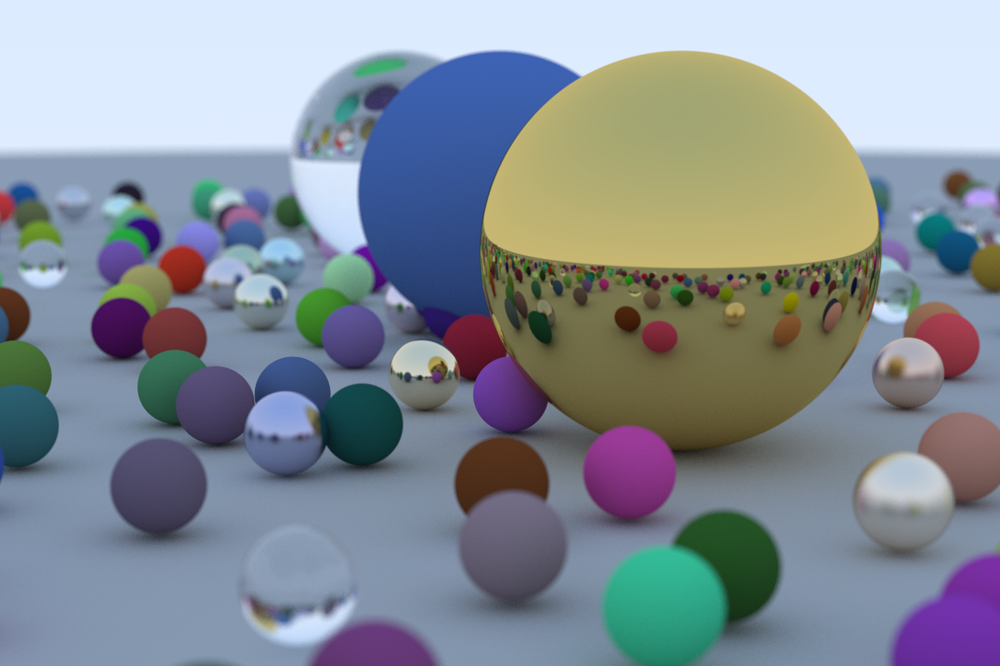

Simple Ray Tracing in Java. Based on the book [The Ray Tracing in One Weekend](https://raytracing.github.io/)

The goal here is to try create a basic and functional ray tracing in Java.

Execution time (for the image below): **4h12min**. 
Aspect ratio: 3:2 | Image Width: 1200px | Samples per pixel: 500 | Max ray bounce: 50 | Number of spheres: 488

